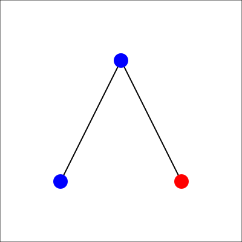
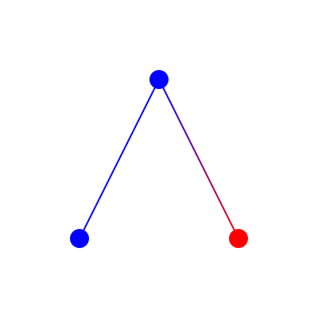
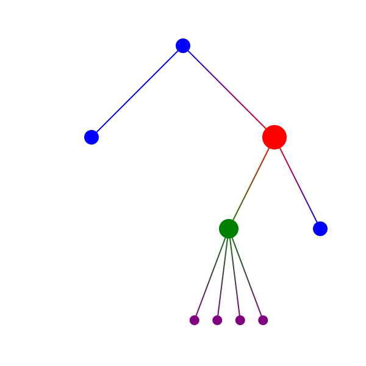
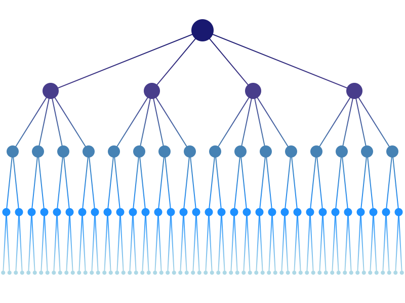
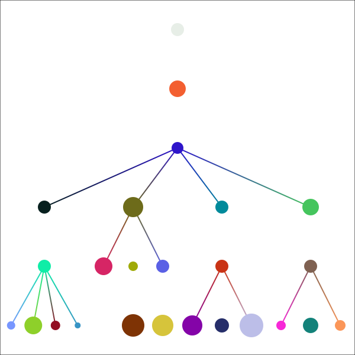
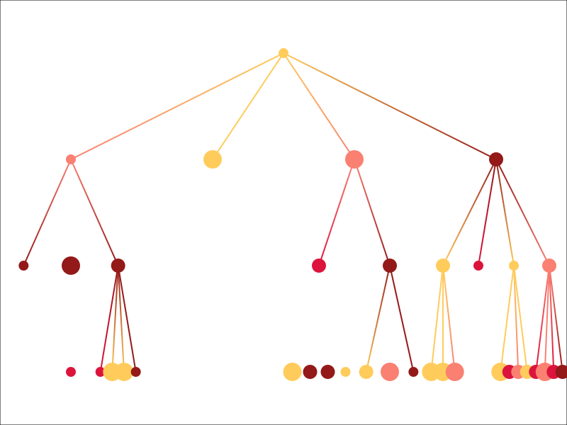

Some examples
=============

This file gathers some basic examples to get started with **🌿 pytreesvg**.

A basic binary tree in three different versions
-----------------------------------------------

Let's draw a basic binary tree while comparing the basic parameters of :meth:`pytreesvg.node_svg.NodeSVG.to_svg`:

.. testcode::

   from pytreesvg.node_svg import NodeSVG, NodeStyle

   tree = NodeSVG(1, children=[NodeSVG(2), NodeSVG(3, style='red@12')])

   tree.to_svg('source/_static/example_1.1.svg', gradient_color=False, image_border=True)
   tree.to_svg('source/_static/example_1.2.svg', gradient_color=False, image_border=False)
   tree.to_svg('source/_static/example_1.3.svg', gradient_color=True, image_border=False)

.. +-------------------------------------+-------------------------------------+-------------------------------------+
.. | .. figure:: _static/example_1.1.svg | .. figure:: _static/example_1.2.svg | .. figure:: _static/example_1.3.svg |
.. |    :alt: example 1.1                |    :alt: example 1.2                |    :alt: example 1.3                |
.. |                                     |                                     |                                     |
.. |    ``example_1.1.svg``              |    ``example_1.2.svg``              |    ``example_1.3.svg``              |
.. +-------------------------------------+-------------------------------------+-------------------------------------+

You can take a quick look at the content of the ``.svg`` file created for the third figure (``example_1.3.svg``):

.. admonition:: See `example_1.3.svg`
   :class: toggle

   .. literalinclude:: _static/example_1.3.svg
      :language: xml

Let's add some colors!
----------------------

Here is a more complex tree:

.. testcode::

   from pytreesvg.node_svg import NodeSVG, NodeStyle

   tree = NodeSVG('-', children=[NodeSVG(1),
                                 NodeSVG('*',
                                         style='red@20',
                                         children=[NodeSVG('+',
                                                           style='green@16',
                                                           children=[NodeSVG(1),
                                                                     NodeSVG(2),
                                                                     NodeSVG(3),
                                                                     NodeSVG(4)]),
                                                   NodeSVG(18)])])

   for child in tree.children[1].children[0].children:
       child.style = NodeStyle('purple@8')

   tree.to_svg('source/_static/example_2.svg', width=600, height=600, gradient_color=True, image_border=False)

And the created ``.svg`` file looks like:

.. admonition:: See `example_2.svg`
   :class: toggle

   .. literalinclude:: _static/example_2.svg
      :language: xml

Create the tree programatically
-------------------------------

.. testcode::

   from pytreesvg.node_svg import NodeSVG, NodeStyle

   tree = NodeSVG('level_1', style='midnightblue@22')

   # create new level
   for i in range(4):
       child = NodeSVG('level_2', style='darkslateblue@16')
       tree.add_child(child)

       # create new sub level
       for j in range(4):
           sub_child = NodeSVG('level_3', style='steelblue@12')
           child.add_child(sub_child)

           # create new sub sub level
           for k in range(2):
               sub_sub_child = NodeSVG('level_4', style='dodgerblue@8')
               sub_child.add_child(sub_sub_child)

               # create new sub sub sub level
               for l in range(2):
                   sub_sub_child.add_child(NodeSVG('level_5', style='lightblue@4'))

   tree.to_svg('source/_static/example_3.svg', width=800, height=600, gradient_color=True, image_border=False)

.. admonition:: See `example_3.svg`
   :class: toggle

   .. literalinclude:: _static/example_3.svg
      :language: xml

You may notice in this example that the :meth:`pytreesvg.node_svg.NodeSVG.add_child` method is not doing a deep copy of 
the given ``NodeSVG`` object, any subsequent modification of the given node will modify the tree containing this node (
see :meth:`pytreesvg.node_svg.NodeSVG.add_child` **Warnings** to have an example).

Create some random tree
-----------------------

Let's create a random tree with the default creation parameters:

.. testcode::

   from pytreesvg.node_svg import NodeSVG
   import random

   random.seed(11) # set random number generator seed for reproducible results

   # create random tree
   tree = NodeSVG.get_random_tree()

   tree.to_svg(path='source/_static/example_4.1.svg', width=600, height=600, gradient_color=True)

.. admonition:: See `example_4.1.svg`
   :class: toggle

   .. literalinclude:: _static/example_4.1.svg
      :language: xml

Now let's customize a little the random tree creation parameters:

.. testcode::

   from pytreesvg.node_svg import NodeSVG
   import random

   random.seed(30) # set random number generator seed for reproducible results

   # create random tree with custom creation parameters
   tree = NodeSVG.get_random_tree(max_depth=3,
                                  n_children=[0, 1, 2, 3, 4],
                                  values=['Michel', 'Julia', 'Robert'],
                                  sizes=[7, 10, 13],
                                  colors=['crimson', 'salmon', '#ffcc5c', 'rgb(58%, 10%, 10%)'])

   tree.to_svg(path='source/_static/example_4.2.svg', width=800, height=600, gradient_color=True)

.. admonition:: See `example_4.2.svg`
   :class: toggle

   .. literalinclude:: _static/example_4.2.svg
      :language: xml
