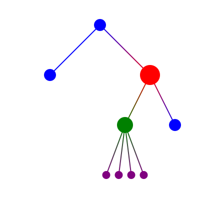

Welcome to **🌿 pytreesvg** documentation!
==========================================

.. image:: https://travis-ci.com/PierreGuilmin/pytreesvg.svg?branch=master
   :target: https://travis-ci.com/PierreGuilmin/pytreesvg
   :alt: build status

.. image:: https://readthedocs.org/projects/pytreesvg/badge/?version=latest
   :target: https://pytreesvg.readthedocs.io/en/latest/?badge=latest
   :alt: documentation status

.. image:: https://img.shields.io/github/license/PierreGuilmin/pytreesvg.svg
   :target: https://github.com/PierreGuilmin/pytreesvg/blob/master/LICENSE
   :alt: MIT license

This project is a lightweight Python module to render SVG trees like the following:

**🌿 pytreesvg** guarantees that the output SVG file strictly follows the `W3C SVG 1.1 (Second Edition) Recommendation 
<https://www.w3.org/TR/2011/REC-SVG11-20110816/>`_.

This module aims to be extremely basic and simple of use, thus it is based on no other existing modules. If you are 
looking for something more complex please take a look at the `Graphviz <https://www.graphviz.org/>`_ project and its 
existing Python implementations.

.. toctree::
   :caption: Table of Contents
   :maxdepth: 2

   self
   examples
   node_svg
   tools
   contribute
   contact
